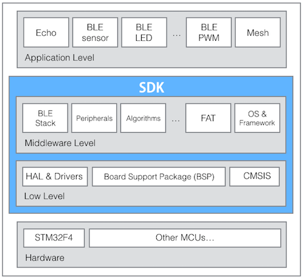

本文阐述小钢炮嵌入式代码的架构，然后介绍应用层编程概况，并附上一个简单的例程作为说明。


***
## 代码托管
小钢炮(下称“Cannon”)的代码托管于github，请点击下述链接访问：  
[https://github.com/JUMA-IO/STM32_Platform](https://github.com/JUMA-IO/STM32_Platform)


打开后的界面如上所述，几点说明：

1. Download ZIP：打包下载整个代码，包含了最新版的提交(Commits)。
2. Releases：我们会定期发布稳定版。
3. Commits：代码提交的历史记录。
4. Watch/Unwatch：如果您想及时获知代码的最新提交(Commits)，点击Watch，会收到邮件通知。
5. Fork：在Cannon的代码基础上，您可以建立起自己的代码空间，便于您自己的项目开发。
6. Issues：如果您发现问题，可以给我们提交Bug或建议。

***
## 代码架构
小钢炮的嵌入式代码架构如下：



> BLE是Bluetooth Low Energy，低功耗蓝牙的简称。

- `Application Level`: 最上层是应用层，开发者通过SDK提供的接口进行编程。
- `Middleware Level`: 中间件层，包括了通信协议栈、外设数据(流)接口、各类算法(安全加解密、运动检测等)、文件系统、操作系统或编程框架。
- `Low Level`: 底层包括了硬件抽象层(HAL/CMSIS)、外设驱动、板级支持包(BSP)等。
- 小钢炮的`SDK`包含了Middleware Level和Low Level两个组建。
- `Hardware`: MCU硬件，小钢炮使用的是STM32F4，不过可以将代码移植到其他MCU上。


***
## 目录结构
从Github下载好代码后，可以看到代码的目录结构如下：


说明如下：


- `/product/applicaton`: 应用层示例，比如echo(蓝牙数据回复)、remote_Control(蓝牙遥控)、hum_temp_monitor(温湿度检测)等。
- `/system/bsp`: 板级支持包。
- `/system/cmsis`: MCU硬件抽象层。
- `/system/drivers`: 各类外设驱动。
- `/system/middlewares`: 各类中间件，如蓝牙协议栈、算法、文件系统等。
- `/tools`: 一些能够配合Cannon使用的辅助工具，如BLE调试助手。

童鞋们可以发现，在上述目录下，会有`juma`或者其他的目录。这是由于Cannon是开源项目，为了保持开放性，需要允许多个组织互不影响的贡献代码。比如一个叫做`juma`的组织贡献了某驱动, 一个叫做`xbar`的组织可以贡献同一个设备的另一种写法的驱动，而且可以共存在代码。

所以，目录结构的基本约定是：

```
	/{subsystem}/{organization}/{module}
```

其中，subsystem是由我们定义的子系统，比如驱动子系统、中间件子系统、应用程序子系统、工具子系统。organization是组织的名称，可以是团队、个人、或者公司。module是模块的名称，模块允许有子目录。

比如，下面是一些允许的目录：

```
	/drivers/juma/lcdXXXX
	/drivers/st/hal
	/applications/juma/sensor_tag
	/middlewares/st/fatfs
	/middlewares/xbar/crypto
	/middlewares/xbar/fuck/you
```

***
## 应用层编程
通常情况下，我们只需要关注应用层编程，无需关注SDK内部细节。这也符合SDK设计的初衷，就是让开发者专注做好应用，而把底层的一些通用的、繁琐的、基础的软件实现交给SDK。

以下，我们以`echo`的例子来介绍应用层编程。

`echo`位于`/product/application/juma/echo/app.c`。它做的事情是监听蓝牙消息，如果收到手机发送过来的消息，则原封不动的回送给手机。

```
#include "app.h"

/*start adv*/
char *name = "CAF_ECHO";
uint8_t adv_address[6] = {0x08, 0x05, 0x04, 0x03, 0x02, 0x04};

void on_ready(void)
{
    uint8_t tx_power_level = 7;
    uint16_t adv_interval = 100;

    /*Config Adv Parameter And Ready to Adv*/
    ble_set_adv_param(name, adv_address, tx_power_level, adv_interval);
    ble_device_start_advertising();
}

/* Device On Message */
void ble_device_on_message(uint8_t type, uint16_t length, uint8_t* value)
{
    /*echo data*/
    ble_device_send(type, length, value);

}
/* Device on connect */
void ble_device_on_connect(void)
{

}

/* Device on disconnect */
void ble_device_on_disconnect(uint8_t reason)
{
    /* Make the device connectable again. */
    Ble_conn_state = BLE_CONNECTABLE;
    ble_device_start_advertising();
}
```

代码不长，涉及了一些蓝牙知识，这里简要介绍一下代码流程：

```
1. 系统就绪 -- on_ready；
2. 设置Cannon的蓝牙广播地址 -- ble_set_adv_param；
3. Cannon开始蓝牙广播 -- ble_device_start_advertising；
4. 手机端APP和Cannon建立连接，假设使用BLE调试助手APP；
5. BLE调试助手APP给Cannon发一些数据；
6. Cannon收到数据后，触发回调事件 -- ble_device_on_message；
7. Cannon将数据原封不动的回传给手机 -- ble_device_send；
8. 手机或Cannon断开连接；
9. Cannon触发断开连接事件 -- ble_device_on_disconnect；
10. Cannon重新开启蓝牙广播 -- ble_device_start_advertising；
```

> 如果您对蓝牙不熟悉，建议先阅读*前一篇*了解蓝牙基本概念。需记住，收发蓝牙数据，需要先要建立连接，而建立连接，需要设备先开启广播。

`echo`例程中用到了`系统`和`BLE从设备`两个软件模块的API，您可以分别点击API文档查看：

- `系统API`：[http://www.juma.io/doc/zh/embedded_api/task/](http://www.juma.io/doc/zh/embedded_api/task/)
- `BLE从设备API`：[http://www.juma.io/doc/zh/embedded_api/ble/](http://www.juma.io/doc/zh/embedded_api/ble/)

> `void on_ready(void)`属于`系统API`，也是应用层编程的第一入口(系统回调事件)，相当于传统的`main()`函数。

以上，我们通过`echo`的代码简要介绍了SDK的应用层编程方式，接下去您可以查阅左侧的其他例程，将会有更丰富的API使用案例。

***
## 贡献代码
我们非常欢迎全国各地的开发者，为Cannon提交代码，不管是修复Bug或是增加Feature，都能让Cannon变得更加完善。

贡献代码采用Github典型的`Fork + Pull Request`的方式，大致流程为：

1. `Fork` Cannon的代码到自己的空间(`repo`)；
2. 在自己的`repo`修改或增加代码；
3. `Commit`提交代码到自己的`repo`；
4. （此时，您的`repo`和我们的`repo`应该不一样了）
5. 通过`Pull Request`向我们提交代码改动申请；
6. 管理员审核通过后，会合并(`merge`)您改动的代码；
7. （此时，我们的`repo`和您的`repo`就一样了）

> 关于`Fork + Pull Request`，这里有一篇[读物](http://www.worldhello.net/gotgithub/04-work-with-others/010-fork-and-pull.html)写的不错，您看了就明白了。  

如果您提交代码，请严格按照`目录结构`中所约定的规范。比如您叫linus，准备提交一个i2c的驱动，则您的代码应放在`/system/drivers/linus/i2c/`文件夹下。比如您的组织是zuma，准备提交一个Fat文件系统，则您的代码应放在`/system/middlewares/zuma/FatFs`文件夹下。


